```mermaid
graph LR
    A["Target Locked"] 
    --> B("Recon → nmap -sC -sV -oA scan")
    --> C("Bruteforce / Enum → dirsearch + ffuf + feroxbuster")
    --> D("Exploit → sqlmap --batch --risk=3 --level=5")
    --> E("Shell → nc -lvnp 4444 + reverse shell")
    --> F("Privilege Escalation → linPEAS + sudo -l")
    --> G["ROOTED — NEXT VICTIM LOADING"]
    
    style A fill:#000,stroke:#ff0000,stroke-width:5px,color:#ff0000
    style G fill:#000,stroke:#ff0000,stroke-width:5px,color:#ff0000
    style B fill:#111,stroke:#ff0000,color:#ff0000
    style C fill:#111,stroke:#ff0000,color:#ff0000
    style D fill:#111,stroke:#ff0000,color:#ff0000
    style E fill:#111,stroke:#ff0000,color:#ff0000
    style F fill:#111,stroke:#ff0000,color:#ff0000
    linkStyle 0,1,2,3,4,5 stroke:#ff0000,stroke-width:6px
```

[<a href="[https://noob-ymuu.site](https://mrci0x1.github.io/)/">](https://mrci0x1.github.io/)
  
</a>

  <h3 align="center">How to be BROO H1K3R</h3>
  

 
  <!-- HackTheBox Dynamic Badge (replace YOUR_ID) -->
   
  <!-- HackTheBox Dynamic Badge (replace YOUR_ID) -->
   

