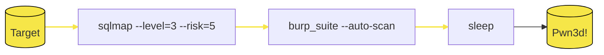

  <h3 align="center">How to be BROO H1K3R</h3>
  

```mermaid
graph LR
    A[("Target")] --> B[sqlmap --level=3 --risk=5]
    B --> C[burp_suite --auto-scan]
    C --> D[sleep]
    D --> E[("Pwn3d!")]
    style A fill:#F7E647,stroke:#000
    style E fill:#F7E647,stroke:#000
    linkStyle 0 stroke:#F7E647,stroke-width:2px
    linkStyle 1 stroke:#F7E647,stroke-width:2px
    linkStyle 2 stroke:#F7E647,stroke-width:2px
```

 
  <!-- HackTheBox Dynamic Badge (replace YOUR_ID) -->
   

