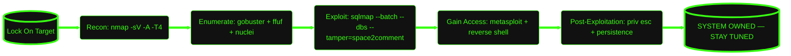

  <h3 align="center">How to be BROO H1K3R</h3>
  

```mermaid
graph LR
    A[("Lock On Target")] 
    --> B(Recon: nmap -sV -A -T4)
    --> C(Enumerate: gobuster + ffuf + nuclei)
    --> D(Exploit: sqlmap --batch --dbs --tamper=space2comment)
    --> E(Gain Access: metasploit + reverse shell)
    --> F(Post-Exploitation: priv esc + persistence)
    --> G[("SYSTEM OWNED — STAY TUNED")]
    
    style A fill:#111,stroke:#39FF14,stroke-width:4px,color:#39FF14
    style G fill:#111,stroke:#39FF14,stroke-width:4px,color:#39FF14
    style B fill:#111,stroke:#39FF14,color:#39FF14,color:#39FF14
    style C fill:#111,stroke:#39FF14,color:#39FF14
    style D fill:#111,stroke:#39FF14,color:#39FF14
    style E fill:#111,stroke:#39FF14,color:#39FF14
    style F fill:#111,stroke:#39FF14,color:#39FF14
    linkStyle 0,1,2,3,4,5 stroke:#39FF14,stroke-width:5px
```

 
  <!-- HackTheBox Dynamic Badge (replace YOUR_ID) -->
   
  <!-- HackTheBox Dynamic Badge (replace YOUR_ID) -->
   

