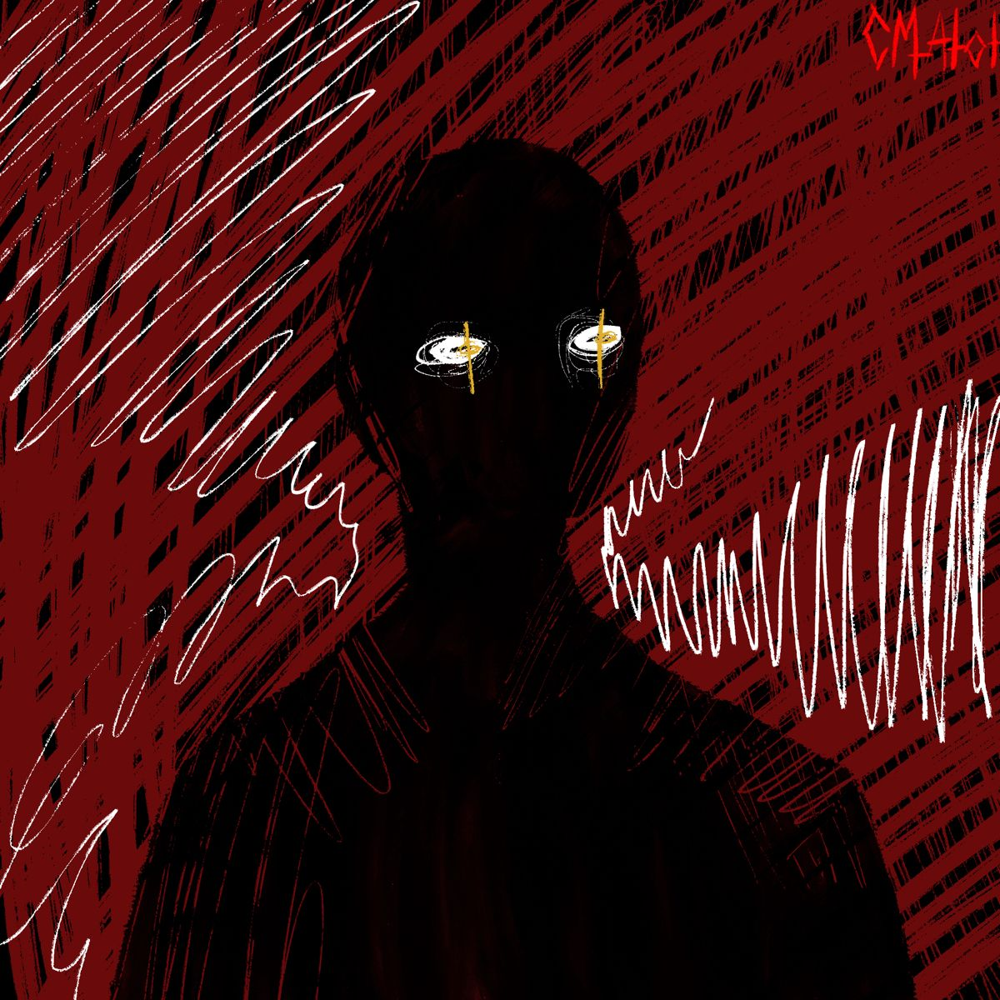

  

 

---

## Focus Areas

<table width="100%" cellspacing="4" cellpadding="8" align="center">
  <tr>
    <td align="left" valign="middle" width="200"><b>Web Pentesting</b></td>
    <td valign="middle">
      &nbsp;&nbsp;
      &nbsp;&nbsp;
      &nbsp;&nbsp;
      &nbsp;&nbsp;
      &nbsp;&nbsp;
      
    </td>
  </tr>
  <tr>
    <td align="left" valign="middle"><b>Android Pentesting</b></td>
    <td valign="middle">
      &nbsp;&nbsp;
      &nbsp;&nbsp;
      &nbsp;&nbsp;
      
    </td>
  </tr>
  <tr>
    <td align="left" valign="middle"><b>Recon & OSINT</b></td>
    <td valign="middle">
      &nbsp;&nbsp;
      &nbsp;&nbsp;
      &nbsp;&nbsp;
      &nbsp;&nbsp;
      
    </td>
  </tr>
  <tr>
    <td align="left" valign="middle"><b>CTF & Platforms</b></td>
    <td valign="middle">
      &nbsp;&nbsp;
      &nbsp;&nbsp;
      &nbsp;&nbsp;
      
    </td>
  </tr>
  <tr>
    <td align="left" valign="middle"><b>Tooling & Dev</b></td>
    <td valign="middle">
      
    </td>
  </tr>
</table>

---

## � HackTheBox

---

## Stats

<table>
  <tr>
    <td valign="middle" align="center" width="20%">
      

        
      

    </td>
    <td valign="middle" width="80%">
      
    </td>
  </tr>
</table>

---

## Activity

<table width="100%">
  <tr>
    <td width="50%" align="center">
      
    </td>
    <td width="50%" align="center">
      
    </td>
  </tr>
</table>

---

## Connect

&nbsp;&nbsp;&nbsp;
&nbsp;&nbsp;&nbsp;
&nbsp;&nbsp;&nbsp;

 

> *"No pain, no gain."*

 

