```mermaid
graph LR
    A[("🎯 Target Acquired")] --> B(sqlmap --level=5 --risk=3 --dbs)
    B --> C(burpsuite + nuclei -t cves/)
    C --> D(metasploit > exploit/multi/handler)
    D --> E[("💀 P W N E D !")]
    style A fill:#0f0,stroke:#000,color:#000
    style E fill:#0f0,stroke:#000,color:#000
    style B fill:#111,stroke:#39FF14,color:#39FF14
    style C fill:#111,stroke:#39FF14,color:#39FF14
    style D fill:#111,stroke:#39FF14,color:#39FF14
    linkStyle 0,1,2,3 stroke:#39FF14,stroke-width:4px
```
  

<h1 align="center">root@brooh1k3r:~# whoami</h1>

  

---

## 🛠️ Arsenal

  
  
  
  
  
  

---

## 🔥 Streak & Stats

  
  

  

---

  

  <i>"There is no patch for stupidity." — Kevin Mitnick</i>

